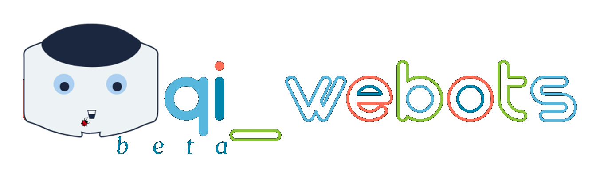

# naoqi_webots
 
This repository is a refactored version of the controller named *naoqisim*: https://github.com/cyberbotics/naoqisim

It aims to solve bugs and outdated pieces of code of the deprecated naoqi-c++-sdk used in it.

The differences between that and this are showed in the folder [what_was_refactored](https://github.com/fernandozuher/naoqi_webots/tree/master/what_was_refactored).

It works as a middleware allowing that Choregraphe and any code using "naoqi SDK SoftBank Robotics" to be used with the simulated robot NAO in Webots.

## Features
 
1. Program robot NAO using a standard SDK developed by its current developer SoftBank Robotics.
2. Use the robot in a well known robotic simulator, Webots.
    
    Save time and your robot of falling by researching in a simulator.

## Versioning
 
beta-0.2, 422,7 MB (zip packed, included naoqi-c++-sdk)

## Getting started

### Dependences

- Operating System: Linux.

    This refactored version works only on Linux. The support for Windows and OSX were temporarily removed in order to improve readability and maintenance of the code.

- Compiler: Standard GCC compiler suite.

- Webots: https://cyberbotics.com/

    Set the WEBOTS_HOME environment variable to point to the Webots installation folder, as documented in the Webots user guide. Also add WEBOTS_HOME/lib to your library path through the terminal:

    export LD_LIBRARY_PATH=$LD_LIBRARY_PATH:$WEBOTS_HOME/lib

- Choregraphe: https://developer.softbankrobotics.com/nao6/downloads/nao6-downloads-linux

    The last version of Webots (R2020b in August 2020) has a model of NAOv5. NAOv6 is not supported. So you should use NAOv5 in Choregraphe too. Modify that in Choregraphe: Edit -> Preferences -> Virtual Robot, in the field "Robot model" select "NAO H25 (V50)".
    
    

Last execution done in:
* Ubuntu 18.04.4
* Webots R2020a revision 1
* Choregraphe Version 2.8.6.23

...but it is supposed to work in newer versions too.

### Build

1. Download this current repository: https://github.com/fernandozuher/naoqi_webots/archive/master.zip

2. Unpack it in a preferred working directory.

3. Compile the naoqi_webots controller: type "make" in the "naoqi_webots/controllers/naoqi_webots" folder.
    
    

What the controller does inside itself:
1. Initializes naoqi process located in the folder "old_aldebaran_cplusplus_sdk".
2. Initializes Webots simulation.
3. Creates an abstract robot NAO that is connected to *naoqi* and *Webots*.

## How to use

1. **Start Webots**. Open the "naoqi_webots/worlds/naoqi_webots.wbt" world file.
    
    

    

2. **Start Choregraphe**. Choose "Connection" > "Connect to" or click the "Connect to" button. (Yes, OK that)
    
    

    Click the "Wake Up" button (sun-like icon on the top right corner of the Choregraphe window) to make sure the stiffness is on.

    

3. Play with the change of the NAO postures in "Pose library" (top right side) or any box that doesn't execute movement with the legs of NAO (current bug coming from the "old Aldebaran C++ SDK").
 
## Links
 
  - Repository: https://github.com/fernandozuher/naoqi_webots
    - In case of sensitive bugs like security vulnerabilities, please contact
      fernando.zuher@gmail.com directly instead of using issue tracker. We value your effort to improve the security and privacy of this project!
   
## Authors
 
* **Fernando Zuher**: @fernandozuher (https://github.com/fernandozuher)
    * This repository is based on *naoqisim* repository: https://github.com/cyberbotics/naoqisim
 
Thank you for visiting and good coding!